# 📋 BÁO CÁO PHÂN TÍCH HỆ THỐNG - EViENT
## Ticket Management and Check-in System

> **Mục tiêu:** Phân tích toàn diện hệ thống EViENT hiện tại để chuẩn bị cho việc rebuild với kiến trúc tối ưu, bảo mật cao và khả năng mở rộng.

---

## 1. 🎯 TỔNG QUAN HỆ THỐNG

### 1.1 Mục tiêu kinh doanh
| Mục tiêu | Mô tả |
|----------|-------|
| **Quản lý sự kiện** | Cho phép tổ chức tạo và quản lý các sự kiện (festivals, pop-up events) |
| **Phát hành vé** | Hệ thống phát hành vé điện tử với QR code |
| **Check-in nhanh** | Rút ngắn thời gian xếp hàng tại cửa bằng QR scanning |
| **VIP Experience** | Hỗ trợ đặt chỗ VIP cho khách hạng sang |

### 1.2 Giá trị cốt lõi
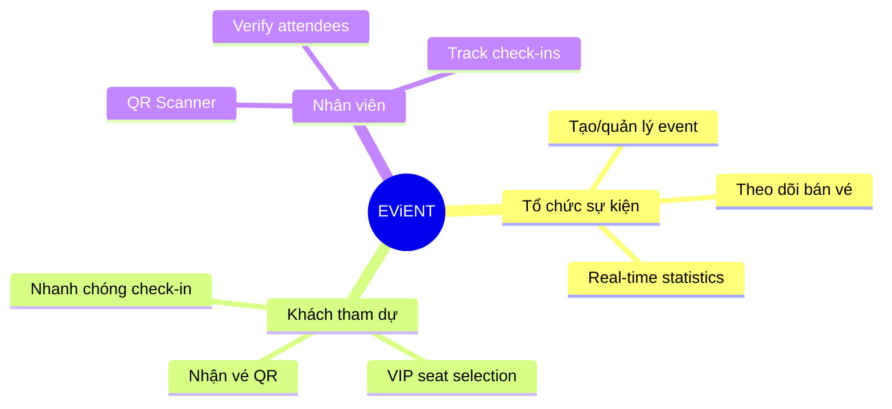

### 1.3 Stakeholders
| Vai trò | Mô tả | Quyền hạn |
|---------|-------|-----------|
| **System Admin** | Quản trị viên hệ thống | Toàn quyền hệ thống |
| **Organization Admin** | Chủ tổ chức sự kiện | Quản lý tổ chức, sự kiện, nhân viên |
| **Staff** | Nhân viên check-in | Sử dụng QR scanner, verify vé |
| **VIP Guest** | Khách VIP | Chọn ghế VIP, check-in |
| **Regular Guest** | Khách thường | Nhận vé, check-in |

---

## 2. 👥 PHÂN TÍCH NGƯỜI DÙNG (User Analysis)

### 2.1 Các nhóm người dùng

#### 🔷 Organization Admin
| Thuộc tính | Chi tiết |
|------------|----------|
| **Hành vi chính** | Tạo sự kiện, quản lý vé, thêm khách mời, xem thống kê |
| **Tần suất** | Hàng ngày trong thời gian chuẩn bị sự kiện |
| **Thiết bị** | Desktop/Laptop (quản lý), Mobile (kiểm tra) |
| **Pain points** | Giao diện phức tạp, thiếu bulk actions, không có mobile app |

#### 🔷 Staff (Nhân viên check-in)
| Thuộc tính | Chi tiết |
|------------|----------|
| **Hành vi chính** | Quét QR, verify vé, xử lý các trường hợp đặc biệt |
| **Tần suất** | Trong suốt sự kiện (cao điểm) |
| **Thiết bị** | Mobile/Tablet |
| **Pain points** | Camera chậm, không offline mode, thiếu thông tin khách |

#### 🔷 VIP Guest
| Thuộc tính | Chi tiết |
|------------|----------|
| **Hành vi chính** | Đăng nhập OTP, chọn ghế VIP, xem vé |
| **Tần suất** | 1-2 lần trước sự kiện |
| **Thiết bị** | Mobile > Desktop |
| **Pain points** | Quy trình đăng nhập phức tạp, không có reminder |

### 2.2 User Journey Maps

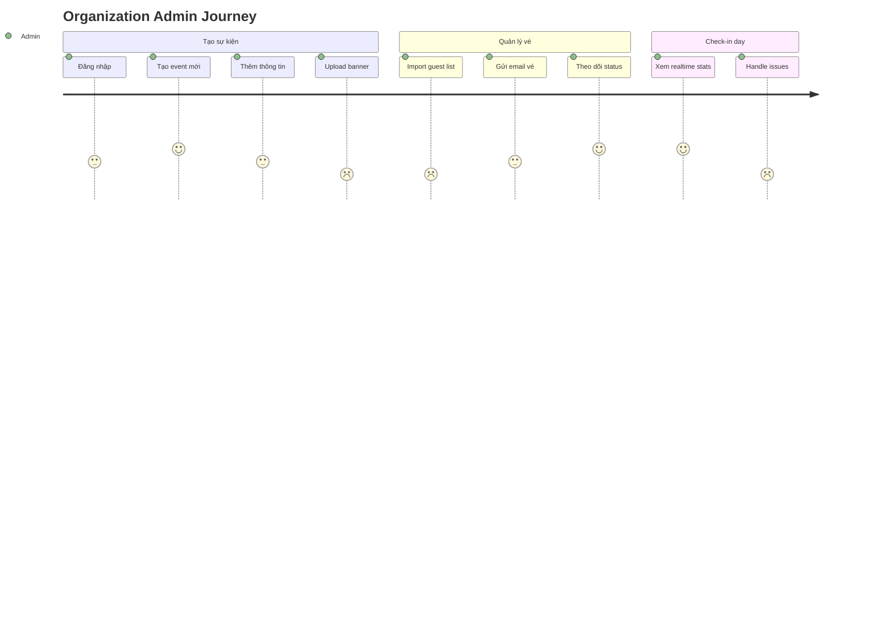

---

## 3. 📊 PHÂN TÍCH CHỨC NĂNG HIỆN TẠI (AS-IS)

### 3.1 Danh sách chức năng

| Module | Chức năng | File liên quan | Trạng thái |
|--------|-----------|----------------|------------|
| **Authentication** | Login (email/password) | `cookies.mjs` | ✅ Hoạt động |
| | Login (Google OAuth) | `cookies.mjs` | ✅ Hoạt động |
| | Đăng ký | `users.mjs` | ✅ Hoạt động |
| | Đăng xuất | `cookies.mjs` | ✅ Hoạt động |
| | Cập nhật profile | `users.mjs` | ✅ Hoạt động |
| **Organization** | Tạo tổ chức (auto khi tạo admin) | `db_user.mjs` | ✅ Tự động |
| | Cập nhật thông tin org | `org.mjs` | ✅ Hoạt động |
| | Thêm/xóa nhân viên | `org.mjs` | ✅ Hoạt động |
| **Event** | Tạo sự kiện | `event.mjs` | ✅ Hoạt động |
| | Chỉnh sửa sự kiện | `event.mjs` | ✅ Hoạt động |
| | Xóa sự kiện | `event.mjs` | ✅ Hoạt động |
| | Danh sách sự kiện | `event.mjs` | ✅ Hoạt động |
| **Tickets** | Thêm khách mời | `event.mjs` | ✅ Hoạt động |
| | Tạo QR code | `local_qr.mjs` | ✅ Hoạt động |
| | Gửi email vé | `sendEmail.mjs` | ✅ Hoạt động |
| | Import bulk (Excel) | `event.mjs` | ✅ Hoạt động |
| **VIP Seats** | Đăng nhập OTP | `event.mjs` | ⚠️ Cơ bản |
| | Chọn ghế VIP | `event.mjs` | ✅ Hoạt động |
| | Lock seat | `event.mjs` | ✅ Hoạt động |
| **Check-in** | Quét QR | `Scanner.jsx` | ✅ Hoạt động |
| | Verify vé | `event.mjs` | ✅ Hoạt động |
| | Lịch sử scan | `db_event.mjs` | ✅ Hoạt động |
| **Quiz** | Quiz real-time | `quiz.mjs` | 🔧 Phát triển |

### 3.2 Flow nghiệp vụ hiện tại

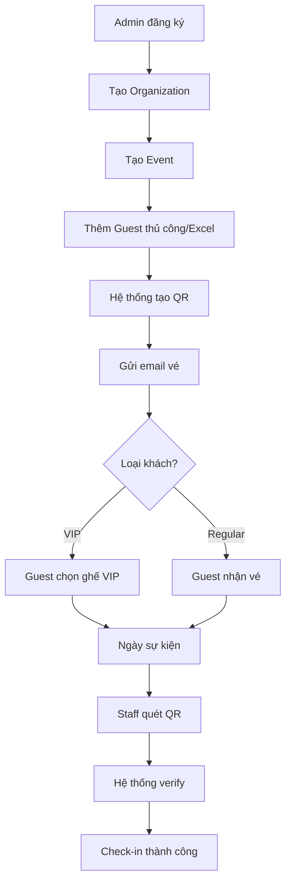

### 3.3 Các điểm bất hợp lý / thiếu sót

#### ⚠️ Vấn đề bảo mật NGHIÊM TRỌNG

| ID | Vấn đề | Mức độ | File |
|----|--------|--------|------|
| SEC-01 | **Hardcoded credentials trong .env** | 🔴 Critical | `.env` |
| SEC-02 | **Session secret yếu** ("30082003") | 🔴 Critical | `.env` |
| SEC-03 | **JWT secret yếu** ("30082003") | 🔴 Critical | `.env` |
| SEC-04 | **Email password trong code** | 🔴 Critical | `.env` |
| SEC-05 | **Firebase API key exposed** | 🟠 High | `.env` |
| SEC-06 | **.env không có trong .gitignore (root)** | 🔴 Critical | `.gitignore` |
| SEC-07 | **Không có rate limiting** | 🟠 High | `index.mjs` |
| SEC-08 | **Thiếu CSRF protection** | 🟠 High | `index.mjs` |
| SEC-09 | **Hardcoded CORS origin** | 🟡 Medium | `index.mjs` |

#### 🔧 Vấn đề kiến trúc

| ID | Vấn đề | Impact |
|----|--------|--------|
| ARCH-01 | 3 MongoDB connections riêng biệt (không cần thiết) | Performance, complexity |
| ARCH-02 | Thiếu middleware authentication thống nhất | Security, maintainability |
| ARCH-03 | Business logic nằm trong route files | Maintainability |
| ARCH-04 | Không có API versioning | Scalability |
| ARCH-05 | Thiếu centralized error handling | Reliability |
| ARCH-06 | Commented code nhiều | Code quality |

#### 📦 Vấn đề kỹ thuật

| ID | Vấn đề | Impact |
|----|--------|--------|
| TECH-01 | Typo: `scr` thay vì `src` trong npm start | Build error |
| TECH-02 | SSL certificates trong repo | Security |
| TECH-03 | Không có Docker setup chuẩn | Deployment |
| TECH-04 | Thiếu testing | Quality |
| TECH-05 | Không có logging chuẩn | Monitoring |

### 3.4 Đánh giá giữ/cải tiến/loại bỏ

| Thành phần | Quyết định | Lý do |
|------------|------------|-------|
| **Core business logic** | ✅ Giữ | Đã hoạt động, cần tái cấu trúc |
| **MongoDB schema** | 🔄 Cải tiến | Cần thêm indexes, validation |
| **Authentication flow** | 🔄 Cải tiến | Cần thêm bảo mật, 2FA |
| **QR generation** | ✅ Giữ | Hoạt động tốt |
| **Email template** | 🔄 Cải tiến | Cần responsive design |
| **Quiz module** | ❌ Loại bỏ/Tách | Không liên quan core business |
| **Teacher/Client pages** | ❌ Loại bỏ | Không rõ mục đích |
| **password2 field** | ❌ Loại bỏ | Anti-pattern |
| **3 DB connections** | 🔄 Hợp nhất | Không cần thiết phân tách |

---

## 4. 🚀 ĐỀ XUẤT HỆ THỐNG MỚI (TO-BE)

### 4.1 Danh sách chức năng hệ thống mới

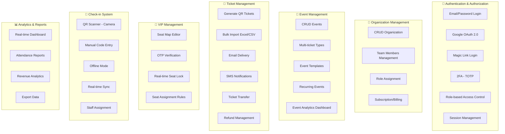

### 4.2 Luồng nghiệp vụ tối ưu

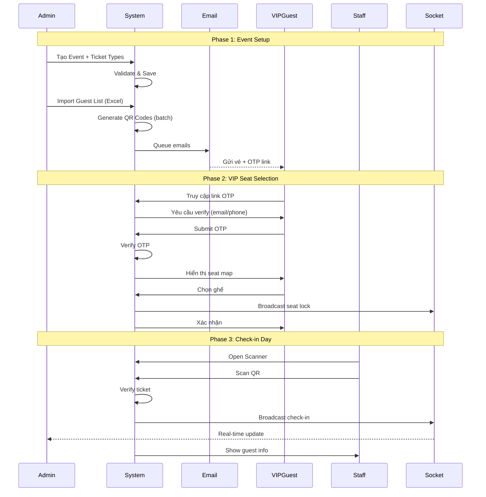

### 4.3 Ưu tiên tính năng (MoSCoW)

| Priority | Feature | Justification |
|----------|---------|---------------|
| **MUST** | Email/Password + OAuth login | Core functionality |
| **MUST** | CRUD Events | Core functionality |
| **MUST** | Generate QR tickets | Core functionality |
| **MUST** | QR Scanner | Core functionality |
| **MUST** | Email delivery | Core functionality |
| **MUST** | Basic dashboard | User needs |
| **SHOULD** | VIP seat selection | Differentiator |
| **SHOULD** | Bulk import | Efficiency |
| **SHOULD** | Real-time stats | User experience |
| **SHOULD** | 2FA | Security |
| **SHOULD** | Offline scanner mode | Reliability |
| **COULD** | SMS notifications | Enhancement |
| **COULD** | Ticket transfer | Enhancement |
| **COULD** | Event templates | Efficiency |
| **COULD** | Mobile app | User experience |
| **WON'T** | Payment processing (v1) | Complexity |
| **WON'T** | Quiz module | Out of scope |

---

## 5. 📝 USE CASE CHI TIẾT

### UC-01: Đăng nhập hệ thống

| Thuộc tính | Chi tiết |
|------------|----------|
| **Actor** | Organization Admin, Staff |
| **Mô tả** | Người dùng đăng nhập để truy cập hệ thống |
| **Pre-condition** | Đã có tài khoản |
| **Post-condition** | Đăng nhập thành công, session được tạo |

**Main Flow:**
1. User truy cập trang login
2. User chọn phương thức (Email/Google)
3. User nhập credentials
4. System validate
5. System tạo session + JWT
6. Redirect to dashboard

**Alternative Flow:**
- 3a. User chọn Google → Redirect OAuth flow
- 5a. 2FA enabled → Yêu cầu TOTP code

**Exception:**
- E1: Credentials sai → Hiển thị error, retry limit
- E2: Account locked → Hiển thị message, contact support
- E3: 2FA fail → Lock after 3 attempts

---

### UC-02: Tạo sự kiện mới

| Thuộc tính | Chi tiết |
|------------|----------|
| **Actor** | Organization Admin |
| **Mô tả** | Admin tạo sự kiện mới cho tổ chức |
| **Pre-condition** | Đã đăng nhập, có quyền admin |
| **Post-condition** | Sự kiện được tạo, sẵn sàng thêm khách |

**Main Flow:**
1. Admin click "Create Event"
2. System hiển thị form
3. Admin nhập: Tên, Địa điểm, Thời gian, Banner
4. Admin định nghĩa ticket types
5. Admin submit
6. System validate & save
7. Redirect to event detail

**Alternative Flow:**
- 4a. Clone từ template → Load thông tin sẵn
- 6a. Validation fail → Highlight lỗi

---

### UC-03: Thêm khách mời (Bulk Import)

| Thuộc tính | Chi tiết |
|------------|----------|
| **Actor** | Organization Admin |
| **Mô tả** | Import danh sách khách từ file Excel |
| **Pre-condition** | Sự kiện đã tồn tại |
| **Post-condition** | Khách được thêm, vé được tạo |

**Main Flow:**
1. Admin truy cập event
2. Admin click "Import Guests"
3. Admin upload Excel file
4. System parse & preview
5. Admin confirm
6. System generate QR codes (background job)
7. System send emails (queue)
8. Hiển thị progress

**Exception:**
- E1: File format sai → Show error template
- E2: Duplicate emails → Highlight, cho phép skip/update
- E3: Email gửi fail → Retry queue, notify admin

---

### UC-04: Check-in bằng QR

| Thuộc tính | Chi tiết |
|------------|----------|
| **Actor** | Staff |
| **Mô tả** | Quét QR để check-in khách |
| **Pre-condition** | Staff đã đăng nhập, có quyền scanner |
| **Post-condition** | Vé được đánh dấu đã check-in |

**Main Flow:**
1. Staff mở Scanner
2. Staff quét QR code
3. System decode & verify
4. System hiển thị thông tin khách
5. Staff confirm check-in
6. System cập nhật status
7. Real-time sync to dashboard

**Alternative Flow:**
- 2a. Camera không hoạt động → Manual code entry
- 3a. Offline mode → Local verify, sync later

**Exception:**
- E1: QR invalid → Show error, manual lookup
- E2: Already checked-in → Show warning, previous check-in info
- E3: Wrong event → Show event mismatch error

---

### UC-05: Chọn ghế VIP

| Thuộc tính | Chi tiết |
|------------|----------|
| **Actor** | VIP Guest |
| **Mô tả** | Khách VIP chọn ghế yêu thích |
| **Pre-condition** | Đã được mời, có OTP link |
| **Post-condition** | Ghế được lock cho khách |

**Main Flow:**
1. Guest click OTP link trong email
2. System yêu cầu verify (email/phone)
3. Guest nhập OTP
4. System verify
5. System hiển thị seat map
6. Guest chọn ghế (số lượng = số vé)
7. System lock seats real-time
8. Guest confirm
9. System cập nhật vé với seat info

**Exception:**
- E1: OTP hết hạn → Gửi lại OTP
- E2: Seat đã bị lock → Refresh, chọn ghế khác
- E3: Session timeout → Start over

---

## 6. ⚙️ NON-FUNCTIONAL REQUIREMENTS

### 6.1 Hiệu năng

| Metric | Requirement | Measurement |
|--------|-------------|-------------|
| **Page Load Time** | < 2s | 95th percentile |
| **API Response Time** | < 500ms | 95th percentile |
| **QR Scan** | < 1s | From scan to result |
| **Concurrent Users** | 500+ | Per event |
| **Ticket Generation** | 1000/min | Background job |
| **Email Delivery** | 1000/5min | Queue rate |

### 6.2 Bảo mật

| Requirement | Implementation |
|-------------|----------------|
| **Password Storage** | bcrypt (cost factor 12) |
| **Session** | HttpOnly, Secure, SameSite cookies |
| **Data in Transit** | TLS 1.3 |
| **Data at Rest** | Encrypted (AES-256) |
| **Rate Limiting** | 100 req/min per IP |
| **CSRF Protection** | Token-based |
| **XSS Prevention** | Content-Security-Policy |
| **SQL Injection** | Parameterized queries |
| **Secret Management** | Environment variables + vault |
| **Audit Logging** | All sensitive operations |

### 6.3 Khả năng mở rộng

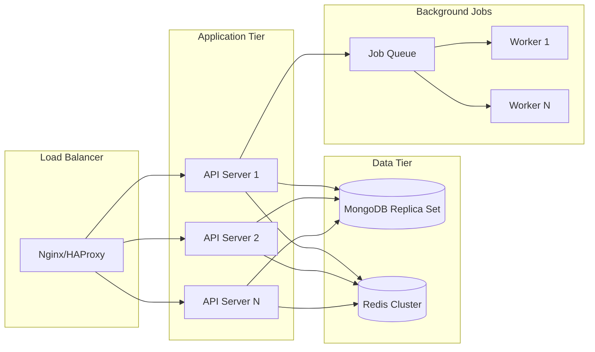

### 6.4 Logging & Monitoring

| Component | Tool | Purpose |
|-----------|------|---------|
| **Application Logs** | Winston/Pino | Structured logging |
| **Access Logs** | Morgan | HTTP request logs |
| **Error Tracking** | Sentry | Exception monitoring |
| **APM** | New Relic / DataDog | Performance monitoring |
| **Metrics** | Prometheus + Grafana | System metrics |
| **Alerting** | PagerDuty | Incident response |

### 6.5 Khả năng maintain

| Aspect | Strategy |
|--------|----------|
| **Code Style** | ESLint + Prettier |
| **Code Review** | PR required |
| **Testing** | Unit + Integration + E2E |
| **Documentation** | API docs (OpenAPI), Code comments |
| **Versioning** | Semantic versioning |
| **CI/CD** | Automated pipeline |

---

## 7. 🏗 KIẾN TRÚC ĐỀ XUẤT

### 7.1 Tổng thể kiến trúc

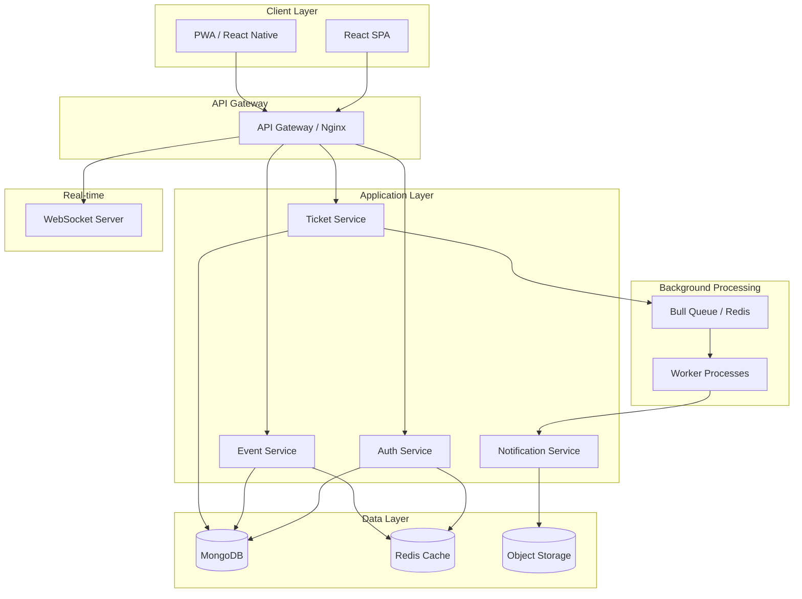

### 7.2 Kiểu kiến trúc: **Modular Monolith** → **Microservices Ready**

**Lý do:**
1. Dễ phát triển ban đầu
2. Không over-engineering
3. Có thể tách thành microservices khi cần
4. Phù hợp với team size nhỏ-vừa

```
src/
├── modules/
│   ├── auth/
│   │   ├── controllers/
│   │   ├── services/
│   │   ├── repositories/
│   │   ├── dtos/
│   │   └── routes.ts
│   ├── organization/
│   ├── event/
│   ├── ticket/
│   └── notification/
├── shared/
│   ├── middleware/
│   ├── utils/
│   ├── database/
│   └── config/
└── index.ts
```

### 7.3 API Design Guidelines

| Principle | Rule |
|-----------|------|
| **Versioning** | `/api/v1/...` |
| **Naming** | Plural nouns (`/events`, `/tickets`) |
| **HTTP Methods** | GET/POST/PUT/PATCH/DELETE |
| **Status Codes** | Standard HTTP codes |
| **Error Format** | `{ error: { code, message, details } }` |
| **Pagination** | `?page=1&limit=20` |
| **Filtering** | `?status=active&type=vip` |
| **Sorting** | `?sort=-createdAt` |
| **Response** | `{ data, meta, pagination }` |

**Example endpoints:**
```
GET    /api/v1/events
POST   /api/v1/events
GET    /api/v1/events/:id
PATCH  /api/v1/events/:id
DELETE /api/v1/events/:id
GET    /api/v1/events/:id/tickets
POST   /api/v1/events/:id/tickets/bulk
POST   /api/v1/tickets/:id/check-in
```

### 7.4 Authentication & Authorization

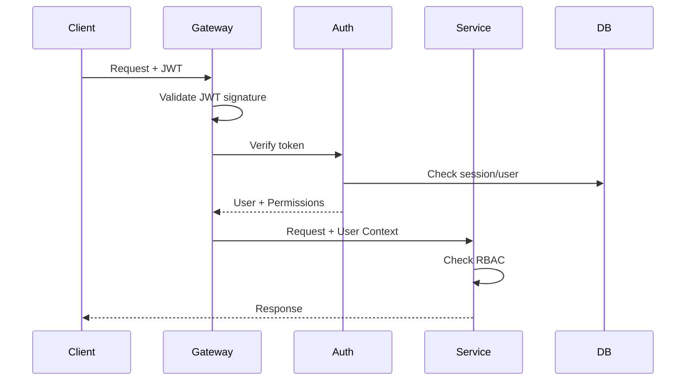

**RBAC Model:**
```typescript
enum Role {
  SUPER_ADMIN = 'super_admin',
  ORG_ADMIN = 'org_admin', 
  ORG_MANAGER = 'org_manager',
  STAFF = 'staff'
}

enum Permission {
  // Events
  CREATE_EVENT = 'event:create',
  READ_EVENT = 'event:read',
  UPDATE_EVENT = 'event:update',
  DELETE_EVENT = 'event:delete',
  
  // Tickets
  CREATE_TICKET = 'ticket:create',
  READ_TICKET = 'ticket:read',
  CHECK_IN = 'ticket:checkin',
  
  // Organization
  MANAGE_USERS = 'org:manage_users',
}
```

---

## 8. 💾 THIẾT KẾ DỮ LIỆU

### 8.1 Entity Relationship Diagram

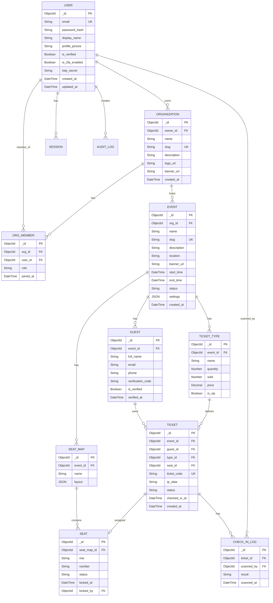

### 8.2 Indexes Strategy

| Collection | Index | Type | Purpose |
|------------|-------|------|---------|
| `users` | `{ email: 1 }` | Unique | Login lookup |
| `users` | `{ googleId: 1 }` | Sparse | OAuth lookup |
| `organizations` | `{ slug: 1 }` | Unique | URL lookup |
| `organizations` | `{ owner_id: 1 }` | Regular | Owner query |
| `events` | `{ org_id: 1, status: 1 }` | Compound | List events |
| `events` | `{ slug: 1 }` | Unique | URL lookup |
| `events` | `{ start_time: 1 }` | Regular | Date filtering |
| `tickets` | `{ ticket_code: 1 }` | Unique | QR lookup |
| `tickets` | `{ event_id: 1, status: 1 }` | Compound | Event stats |
| `tickets` | `{ guest_id: 1 }` | Regular | Guest tickets |
| `guests` | `{ event_id: 1, email: 1 }` | Compound, Unique | Duplicate check |
| `check_in_logs` | `{ ticket_id: 1, scanned_at: -1 }` | Compound | History |
| `seats` | `{ seat_map_id: 1, status: 1 }` | Compound | Available seats |

### 8.3 Data Migration Strategy

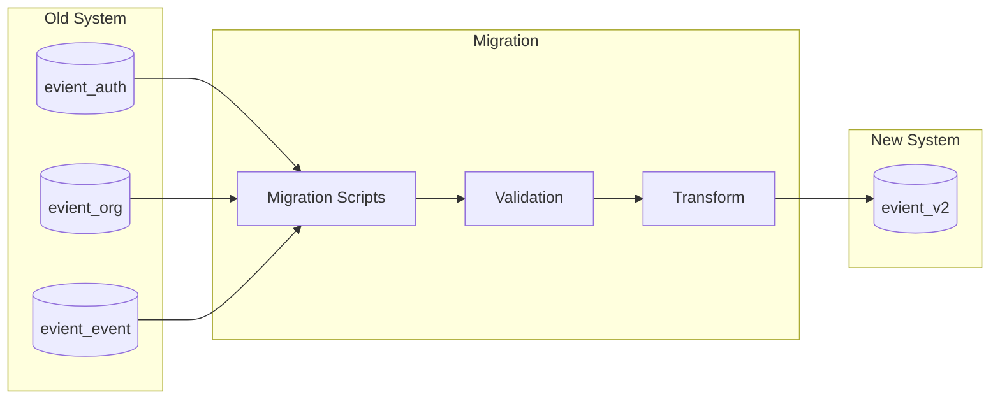

---

## 9. 🛠 TECH STACK ĐỀ XUẤT

### 9.1 Frontend

| Layer | Technology | Reasoning |
|-------|------------|-----------|
| **Framework** | Next.js 14 (App Router) | SSR, SEO, Performance |
| **Language** | TypeScript | Type safety |
| **Styling** | TailwindCSS + shadcn/ui | Modern, consistent |
| **State** | Zustand / TanStack Query | Simple, efficient |
| **Forms** | React Hook Form + Zod | Validation |
| **Real-time** | Socket.io-client | WebSocket |
| **Charts** | Recharts | Visualization |
| **Testing** | Vitest + Playwright | E2E |

### 9.2 Backend

| Layer | Technology | Reasoning |
|-------|------------|-----------|
| **Runtime** | Node.js 20 LTS | Stable, long-term |
| **Framework** | Fastify / Express | Performance, ecosystem |
| **Language** | TypeScript | Type safety |
| **Validation** | Zod | Schema validation |
| **ORM** | Mongoose | MongoDB integration |
| **Queue** | BullMQ | Background jobs |
| **Email** | Nodemailer + React Email | Templates |
| **Testing** | Vitest + Supertest | Unit + Integration |

### 9.3 Database & Cache

| Component | Technology | Reasoning |
|-----------|------------|-----------|
| **Primary DB** | MongoDB Atlas | Flexible schema, scaling |
| **Cache** | Redis | Sessions, rate limiting |
| **Search** | MongoDB Atlas Search | Full-text search |
| **Object Storage** | S3 / Cloudflare R2 | QR images, uploads |

### 9.4 Infrastructure & DevOps

| Component | Technology | Reasoning |
|-----------|------------|-----------|
| **Containerization** | Docker | Consistency |
| **Orchestration** | Docker Compose / k8s | Deployment |
| **CI/CD** | GitHub Actions | Automation |
| **Hosting** | Vercel (FE) + Railway/Fly.io (BE) | Easy deployment |
| **CDN** | Cloudflare | Performance |
| **Monitoring** | Sentry + LogTail | Observability |
| **Secrets** | Doppler / 1Password | Secret management |

### 9.5 So sánh với hệ thống cũ

| Aspect | Old | New | Improvement |
|--------|-----|-----|-------------|
| **Frontend** | React + Vite | Next.js 14 | SSR, SEO |
| **Styling** | TailwindCSS | TailwindCSS + shadcn | Better components |
| **Backend** | Express | Fastify | ~2x faster |
| **TypeScript** | No | Yes | Type safety |
| **Testing** | None | Full coverage | Quality |
| **DB Structure** | 3 databases | 1 database | Simplicity |
| **Background Jobs** | Node-cron | BullMQ | Reliability |
| **Deployment** | Manual SSL | Docker + CD | Automation |

---

## 10. 📅 ROADMAP XÂY DỰNG LẠI

### 10.1 Giai đoạn 1: MVP (4-6 tuần)

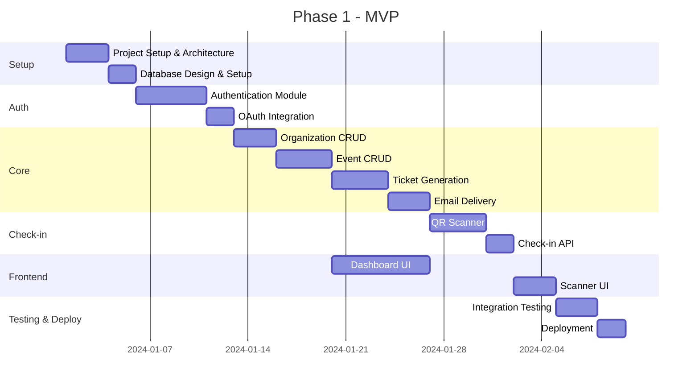

**Deliverables:**
- ✅ User authentication (email + Google)
- ✅ Create/manage organizations
- ✅ Create/manage events
- ✅ Add guests (manual + Excel import)
- ✅ Generate QR tickets
- ✅ Send email with tickets
- ✅ QR Scanner for check-in
- ✅ Basic dashboard

### 10.2 Giai đoạn 2: Enhanced Features (4-6 tuần)

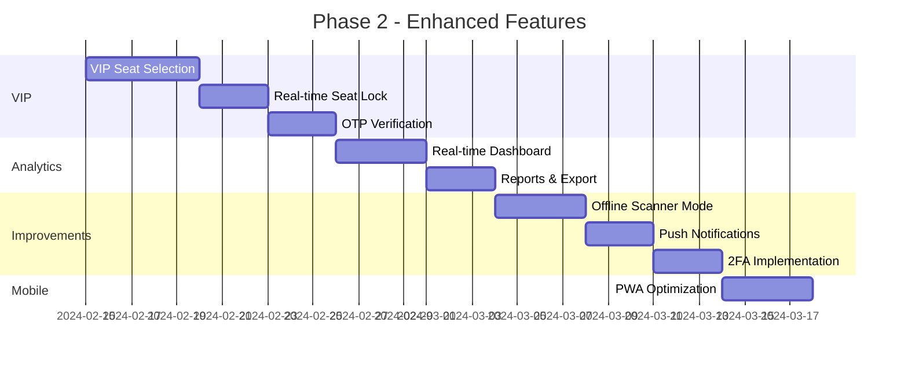

**Deliverables:**
- ✅ VIP seat selection với real-time sync
- ✅ OTP verification cho VIP guests
- ✅ Real-time analytics dashboard
- ✅ Offline scanner mode
- ✅ 2FA cho accounts
- ✅ PWA for mobile

### 10.3 Giai đoạn 3: Scale & Optimize (4-6 tuần)

**Focus areas:**
- 🔧 Performance optimization
- 🔧 Kubernetes deployment
- 🔧 Auto-scaling setup
- 🔧 Advanced analytics
- 🔧 API rate limiting refinement
- 🔧 Multi-language support
- 🔧 White-label capabilities

---

## 11. ⚠️ RỦI RO & KHUYẾN NGHỊ

### 11.1 Rủi ro kỹ thuật

| ID | Rủi ro | Khả năng | Tác động | Mitigration |
|----|--------|----------|----------|-------------|
| R1 | Data migration failure | Medium | High | Staged migration, rollback plan |
| R2 | Performance issues at scale | Medium | High | Load testing, caching strategy |
| R3 | Security vulnerabilities | Low | Critical | Security audit, penetration testing |
| R4 | Third-party service downtime | Low | Medium | Fallback mechanisms, SLA monitoring |
| R5 | Team learning curve (TypeScript) | Medium | Low | Training, code review |

### 11.2 Rủi ro nghiệp vụ

| ID | Rủi ro | Khả năng | Tác động | Mitigration |
|----|--------|----------|----------|-------------|
| B1 | User resistance to new UI | Medium | Medium | Beta testing, feedback loop |
| B2 | Feature creep | High | Medium | Strict scope management |
| B3 | Timeline overrun | Medium | Medium | Buffer time, prioritization |
| B4 | Data loss during migration | Low | Critical | Backup, validation checks |

### 11.3 Khuyến nghị

> [!IMPORTANT]
> **Ưu tiên cao nhất: Bảo mật**
> 1. KHÔNG commit secrets vào git
> 2. Sử dụng secret manager (Doppler/1Password)
> 3. Implement rate limiting từ đầu
> 4. Security audit trước khi go-live

> [!TIP]
> **Chiến lược phát triển:**
> 1. Bắt đầu với MVP nhỏ, iterate nhanh
> 2. Feature flags cho soft launch
> 3. A/B testing cho UI changes
> 4. Monitoring từ day 1

> [!CAUTION]
> **Những điều cần tránh:**
> 1. Over-engineering từ đầu (microservices quá sớm)
> 2. Bỏ qua testing
> 3. Deploy trực tiếp production không có staging
> 4. Ignore technical debt

---

## 📎 Phụ lục

### A. File Structure đề xuất

```
evient-v2/
├── apps/
│   ├── web/                    # Next.js frontend
│   │   ├── app/
│   │   ├── components/
│   │   ├── lib/
│   │   └── package.json
│   └── api/                    # Fastify backend
│       ├── src/
│       │   ├── modules/
│       │   ├── shared/
│       │   └── index.ts
│       └── package.json
├── packages/
│   ├── shared-types/           # Shared TypeScript types
│   ├── ui/                     # Shared UI components
│   └── config/                 # Shared configurations
├── docker/
│   ├── docker-compose.yml
│   └── Dockerfile.*
├── docs/
│   ├── api/
│   └── architecture/
├── scripts/
│   ├── migrate.ts
│   └── seed.ts
├── .github/
│   └── workflows/
├── turbo.json
└── package.json
```

### B. API Documentation Template

```yaml
openapi: 3.0.3
info:
  title: EViENT API
  version: 1.0.0
  
servers:
  - url: https://api.evient.app/v1
    
paths:
  /events:
    get:
      summary: List events
      security:
        - bearerAuth: []
      parameters:
        - name: page
          in: query
          schema:
            type: integer
      responses:
        200:
          description: Success
```

### C. Environment Variables Template

```env
# Application
NODE_ENV=production
PORT=3000
API_URL=https://api.evient.app

# Database
MONGODB_URI=mongodb+srv://...
REDIS_URL=redis://...

# Auth
JWT_SECRET=<generated-256-bit-key>
SESSION_SECRET=<generated-256-bit-key>

# OAuth
GOOGLE_CLIENT_ID=
GOOGLE_CLIENT_SECRET=

# Email
SMTP_HOST=
SMTP_PORT=
SMTP_USER=
SMTP_PASS=

# Storage
S3_BUCKET=
S3_ACCESS_KEY=
S3_SECRET_KEY=
```

---

## 13. 🎫 ĐỀ XUẤT CẢI TIẾN: QR TICKET GENERATION SYSTEM

### 13.1 Tổng quan

Hệ thống tạo vé QR đơn giản và hiệu quả:
1. Tạo vé → Gắn UUID/ID duy nhất
2. Check trùng lặp trước khi lưu
3. Chuyển ID thành mã QR

### 13.2 Ticket Code Generation

#### Option 1: UUID v4 (Recommended)
```typescript
import { v4 as uuidv4 } from 'uuid';

function generateTicketCode(): string {
  return uuidv4(); // "550e8400-e29b-41d4-a716-446655440000"
}
```

#### Option 2: Database ObjectId
```typescript
// Dùng trực tiếp MongoDB ObjectId
const ticketCode = ticket._id.toString(); // "507f1f77bcf86cd799439011"
```

#### Option 3: Custom Format (Short & Readable)
```typescript
import crypto from 'crypto';

function generateTicketCode(prefix: string = 'TKT'): string {
  const random = crypto.randomBytes(6).toString('hex').toUpperCase();
  return `${prefix}-${random}`; // "TKT-A1B2C3D4E5F6"
}
```

### 13.3 Duplicate Check Function

```typescript
// services/ticket.service.ts
async function isTicketCodeUnique(code: string): Promise<boolean> {
  const existing = await Ticket.findOne({ ticketCode: code }).lean();
  return !existing;
}

async function generateUniqueTicketCode(): Promise<string> {
  let code: string;
  let isUnique = false;
  let attempts = 0;
  const MAX_ATTEMPTS = 5;
  
  while (!isUnique && attempts < MAX_ATTEMPTS) {
    code = generateTicketCode();
    isUnique = await isTicketCodeUnique(code);
    attempts++;
  }
  
  if (!isUnique) {
    throw new Error('Failed to generate unique ticket code');
  }
  
  return code;
}
```

### 13.4 QR Code Generation

```typescript
import QRCode from 'qrcode';

interface QROptions {
  width?: number;
  margin?: number;
  color?: { dark: string; light: string };
}

async function generateQRCode(
  ticketCode: string, 
  options: QROptions = {}
): Promise<string> {
  const defaultOptions = {
    width: 300,
    margin: 2,
    color: { dark: '#000000', light: '#FFFFFF' }
  };
  
  const qrOptions = { ...defaultOptions, ...options };
  
  // Generate QR as Data URL (base64)
  const qrDataUrl = await QRCode.toDataURL(ticketCode, qrOptions);
  return qrDataUrl;
}

// Hoặc save file
async function saveQRToFile(
  ticketCode: string, 
  filePath: string
): Promise<void> {
  await QRCode.toFile(filePath, ticketCode, { width: 300 });
}
```

### 13.5 Complete Ticket Creation Flow

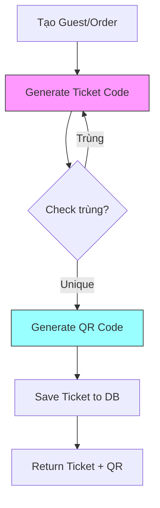

### 13.6 Ticket Schema

```typescript
const ticketSchema = new Schema({
  eventId: { type: ObjectId, ref: 'Event', required: true },
  guestId: { type: ObjectId, ref: 'Guest', required: true },
  
  // Unique ticket identifier
  ticketCode: { 
    type: String, 
    required: true, 
    unique: true,  // DB-level unique constraint
    index: true 
  },
  
  // QR Data
  qrCodeUrl: { type: String },      // Data URL hoặc file path
  qrCodeData: { type: String },     // Raw QR content
  
  // Status
  status: {
    type: String,
    enum: ['valid', 'used', 'cancelled'],
    default: 'valid'
  },
  usedAt: { type: Date, default: null },
  
  // Metadata
  ticketType: { type: String },
  seatNumber: { type: String, default: null }
}, { timestamps: true });

// Index for fast lookup during scan
ticketSchema.index({ ticketCode: 1 });
ticketSchema.index({ eventId: 1, status: 1 });
```

### 13.7 API Endpoints

```
POST /api/v1/events/:eventId/tickets      # Create ticket(s)
GET  /api/v1/tickets/:ticketCode          # Get ticket by code
GET  /api/v1/tickets/:ticketCode/qr       # Get QR image
POST /api/v1/tickets/:ticketCode/scan     # Scan/check-in
```

### 13.8 QR Scan Verification

```typescript
async function verifyTicket(ticketCode: string): Promise<VerifyResult> {
  const ticket = await Ticket.findOne({ ticketCode })
    .populate('guestId')
    .populate('eventId');
  
  if (!ticket) {
    return { valid: false, error: 'TICKET_NOT_FOUND' };
  }
  
  if (ticket.status === 'used') {
    return { 
      valid: false, 
      error: 'ALREADY_USED',
      usedAt: ticket.usedAt 
    };
  }
  
  if (ticket.status === 'cancelled') {
    return { valid: false, error: 'TICKET_CANCELLED' };
  }
  
  return { 
    valid: true, 
    ticket,
    guest: ticket.guestId,
    event: ticket.eventId
  };
}
```

> [!TIP]
> **Best Practice:** Sử dụng UUID v4 cho production vì collision probability cực thấp (~2^-122)

---

## 12. 🔐 ĐỀ XUẤT CẢI TIẾN: GUEST VERIFICATION SYSTEM

### 12.1 Tổng quan

Hệ thống xác thực Guest đảm bảo chỉ những người dùng đã xác minh mới có thể sử dụng dịch vụ, đồng thời ngăn chặn việc đăng ký/đặt dịch vụ nhiều lần.

> [!IMPORTANT]
> **Nguyên tắc cốt lõi:**
> - Mỗi email/phone chỉ được sử dụng **MỘT LẦN** trong toàn hệ thống
> - Guest chưa verified bị **CHẶN TOÀN BỘ** chức năng
> - VIP Guest phải verify **CẢ email VÀ phone**

### 12.2 Database Schema Updates

#### Guest Schema (Enhanced)

```typescript
interface IGuest {
  // Personal Info
  fullName: string;
  email: string;          // UNIQUE toàn hệ thống
  phone: string;          // UNIQUE toàn hệ thống
  
  // Verification Status
  verified: boolean;       // Master flag
  emailVerified: boolean;
  phoneVerified: boolean;
  emailVerifiedAt: Date | null;
  phoneVerifiedAt: Date | null;
  
  // Guest Type
  guestType: 'regular' | 'vip';
}
```

#### Indexes & Constraints

| Field | Index Type | Scope | Purpose |
|-------|------------|-------|---------|
| `email` | UNIQUE | Global | Prevent duplicate registrations |
| `phone` | UNIQUE | Global | Prevent phone number reuse |
| `{eventId, verified}` | Compound | Per event | Query optimization |

### 12.3 Verification Flow

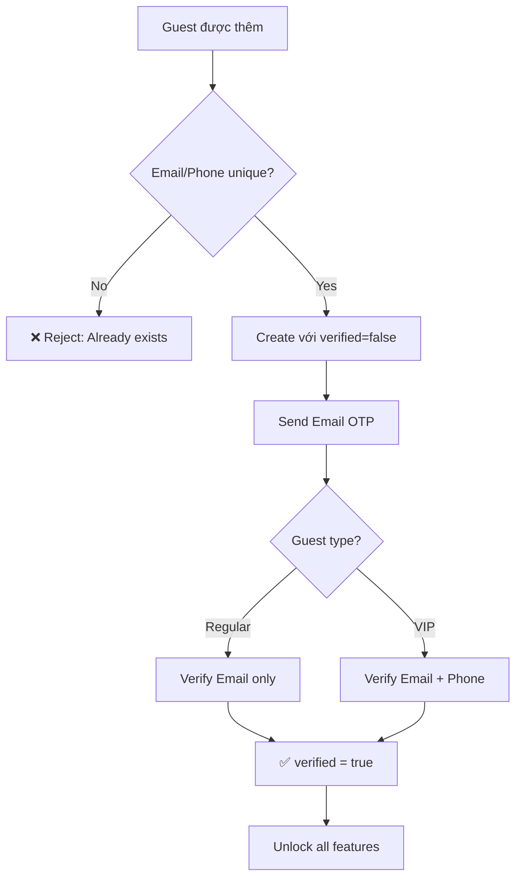

### 12.4 OTP Configuration

| Parameter | Email OTP | SMS OTP |
|-----------|-----------|---------|
| **Length** | 6 digits | 6 digits |
| **Expiry** | 10 minutes | 5 minutes |
| **Max Attempts** | 3 | 3 |
| **Rate Limit** | 5/hour | 3/hour |
| **Storage** | Hashed (SHA-256) | Hashed (SHA-256) |

### 12.5 Security Mechanisms

| Threat | Prevention |
|--------|------------|
| **OTP Brute Force** | Max 3 attempts → invalidate token |
| **OTP Flooding** | Rate limiting per email/phone |
| **Timing Attack** | Timing-safe comparison |
| **Account Takeover** | Device fingerprinting (optional) |
| **Disposable Emails** | Block known domains |
| **Replay Attack** | One-time tokens, mark used |

### 12.6 API Endpoints

```
POST /api/v1/verify/email/request    # Request email OTP
POST /api/v1/verify/email/confirm    # Verify email OTP
POST /api/v1/verify/phone/request    # Request SMS OTP  
POST /api/v1/verify/phone/confirm    # Verify SMS OTP
GET  /api/v1/verify/status/:guestId  # Get verification status
POST /api/v1/verify/resend           # Resend OTP
```

### 12.7 Middleware Integration

```typescript
// Chặn tất cả unverified guests
router.get('/seats/:eventId', requireVerified(), controller.getSeatMap);

// VIP: Yêu cầu verify cả email + phone
router.post('/seats/lock', requireVIPVerified(), controller.lockSeats);
```

### 12.8 Edge Cases

| Case | Handling |
|------|----------|
| Email đã dùng ở event khác | Reject: "Email already registered" |
| Guest cố verify lại | Return current verified status |
| OTP expired khi đang nhập | Prompt resend, không trừ attempt |
| Phone thay đổi sau verified | Require re-verification |

> [!TIP]
> **Chi tiết kỹ thuật đầy đủ:** Xem [implementation_plan.md](file:///C:/Users/admin/.gemini/antigravity/brain/92787526-c211-45a9-8eff-2e0fed3bdd01/implementation_plan.md)

---

## 📎 Phụ lục

---

> **Tài liệu này được tạo:** 2024-12-15  
> **Phiên bản:** 1.1  
> **Cập nhật:** Thêm Guest Verification System  
> **Tác giả:** BA Analysis by Claude
